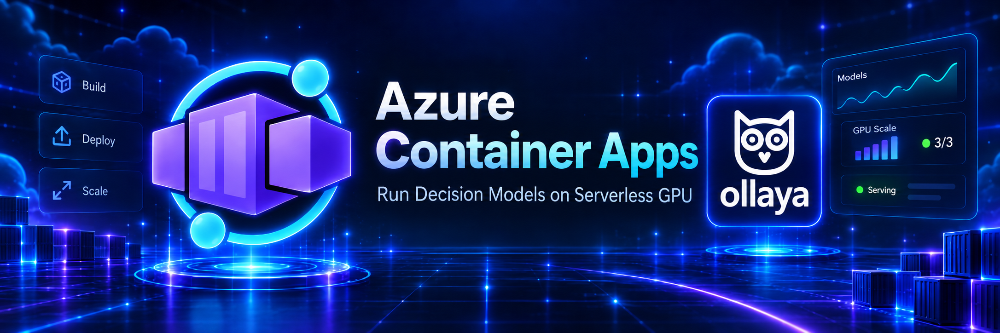
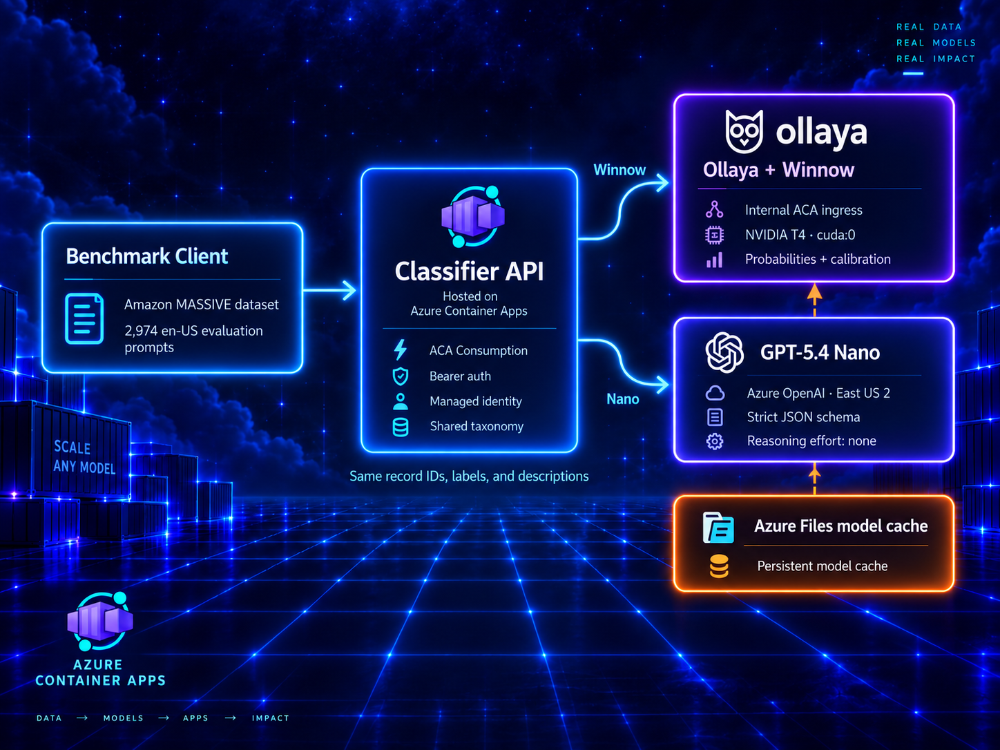

<p align="center">
  
</p>

# Ollaya Decision Model on Azure Container Apps

## Overview

A decision model selects from a predefined set of choices and returns a score or probability for each option. Unlike a traditional LLM, which generates open-ended text token by token, a decision model is designed for bounded tasks such as intent classification, routing, prioritization, and policy selection. This narrower output can provide lower and more predictable latency, explicit confidence scores, and simpler validation.

This sample deploys **Ollaya `winnow:e4b`** on an Azure Container Apps serverless NVIDIA T4 GPU. It can be deployed by itself as an authenticated classification endpoint or benchmarked against **Azure OpenAI GPT-5.4 Nano** using all 2,974 records in the Amazon MASSIVE 1.1 `en-US` test split.

The original OpenCode routing sample is preserved in the immutable [`ollaya+opencode`](https://github.com/simonjj/ollaya-on-aca/tree/ollaya%2Bopencode) tag.

## Quickstart

The commands below use PowerShell and assume the Azure CLI and Azure Developer CLI are already authenticated.

### Deploy Ollaya only

```powershell
git clone https://github.com/simonjj/ollaya-on-aca.git
cd ollaya-on-aca

azd env new ollaya-only
azd env set AZURE_RESOURCE_GROUP ollaya-only
azd env set AZURE_LOCATION southcentralus
azd env set DEPLOYMENT_MODE ollaya-only
azd up
```

This deploys Winnow on a T4 GPU, its persistent model cache, and the authenticated classifier API without creating Azure OpenAI resources.

### Deploy and run the benchmark

```powershell
azd env new ollaya-benchmark
azd env set AZURE_RESOURCE_GROUP ollaya-benchmark
azd env set AZURE_LOCATION southcentralus
azd env set DEPLOYMENT_MODE full
azd env set NANO_CAPACITY 100
azd up

npm ci
$env:CLASSIFIER_ENDPOINT = azd env get-value CLASSIFIER_ENDPOINT
$env:CLASSIFIER_API_KEY = azd env get-value CLASSIFIER_API_KEY

# Fast deployment validation.
npm run benchmark -- `
  --profile smoke `
  --provider both `
  --mode both `
  --concurrency 8 `
  --output .\benchmark-work\smoke.json

# Complete 2,974-record comparison.
npm run benchmark -- `
  --profile standard `
  --provider both `
  --mode both `
  --concurrency 8 `
  --output .\benchmarks\results.json
```

The full mode deploys the same Winnow endpoint plus GPT-5.4 Nano and reports accuracy, macro-F1, calibration, latency, throughput, failures, token usage, and estimated inference cost.

## Why GPT-5.4 Nano?

GPT-5.4 Nano is the appropriate hosted comparison because the task is bounded classification rather than generation. It is the smallest fast GPT-5.4 tier available in Azure OpenAI, supports strict JSON-schema output, and can classify against the same fixed 18-scenario and 60-intent taxonomy as Winnow.

This is not an equivalence claim. Winnow is a local decision model that returns probabilities; Nano is a hosted generative model constrained to return labels. The benchmark therefore compares task outcomes and operational characteristics, but calibration is reported only for Winnow.

## Architecture

<p align="center">
  
</p>

The public API uses a generated bearer token. Raw Ollaya ingress is internal to the Container Apps environment. Azure OpenAI local keys are disabled; the API calls Nano through a user-assigned managed identity.

## Published result

The benchmark was run on September 30, 2026 against the complete MASSIVE `en-US` test split. Latency and throughput modes ran sequentially so they did not contend with each other.

<!-- BENCHMARK_RESULTS_START -->
### Latency mode

Concurrency 1, with all failures counted as incorrect:

| Provider | Successful | Intent accuracy | Intent macro-F1 | Scenario accuracy | p50 | p95 | p99 | Requests/s | Estimated cost |
|---|---:|---:|---:|---:|---:|---:|---:|---:|---:|
| Winnow on T4 | 2,974 / 2,974 | 75.59% | 76.40% | 79.89% | 946 ms | 960 ms | 967 ms | 1.059 | $0.2472 GPU time |
| GPT-5.4 Nano | 2,974 / 2,974 | 79.12% | 78.07% | 85.21% | 1,369 ms | 2,489 ms | 4,555 ms | 0.647 | $0.2462 tokens |

Nano led intent accuracy by 3.53 percentage points. Winnow was 30.9% faster at p50 and 61.4% faster at p95, with a substantially tighter tail.

### Throughput mode

Requested concurrency 8:

| Provider | Successful | Intent accuracy | Intent macro-F1 | Scenario accuracy | p50 request latency | p95 | Requests/s | Estimated cost |
|---|---:|---:|---:|---:|---:|---:|---:|---:|
| Winnow on T4 | 2,974 / 2,974 | 75.66% | 76.40% | 79.86% | 7,161 ms | 7,196 ms | 1.120 | $0.2336 GPU time |
| GPT-5.4 Nano | 2,949 / 2,974 | 78.38% | 77.45% | 84.36% | 1,292 ms | 2,476 ms | 1.367 | $0.2458 tokens |

Nano produced 22.0% more requests per second, but 25 requests still failed after eight retries because the deployment exceeded its token-rate limit. The reported 78.38% accuracy counts those failures as incorrect; successful Nano responses retained approximately the same accuracy as latency mode. Of the 2,949 successful requests, 1,303 needed at least one retry.

Winnow completed without failures, but concurrency did not materially raise throughput: its single loaded runner serialized work, so queueing increased median request latency from 946 ms to 7.16 seconds.

### Winnow confidence

Winnow's expected calibration error was 0.0693 in latency mode. Raising the acceptance threshold traded coverage for accuracy:

| Minimum intent probability | Coverage | Accuracy among accepted |
|---:|---:|---:|
| 0.50 | 89.74% | 80.48% |
| 0.70 | 76.33% | 85.81% |
| 0.80 | 66.78% | 89.22% |
| 0.90 | 53.73% | 94.43% |

The estimated costs are similar by coincidence and are not equivalent cost scopes. Winnow includes only the T4 GPU meter during benchmark wall time; Nano includes input, cached-input, and output tokens. Winnow's always-warm replica, CPU/memory, storage, logging, registry, and network charges are excluded. Azure Cost Management had not posted actual charges for the resource group when this report was finalized.

See [`benchmarks/results.json`](benchmarks/results.json) for all predictions, probabilities, retries, token usage, timings, errors, and configuration metadata.
<!-- BENCHMARK_RESULTS_END -->

Treat these measurements as a reproducible comparison of this deployment, not a universal ranking. Region, quota, model revision, cache state, concurrency, and service load all affect latency and cost.

## Prerequisites

- Azure CLI authenticated to the target subscription.
- Azure Developer CLI (`azd`).
- Node.js 22 or later.
- Permission to create resource groups, role assignments, Container Apps environments, ACR, Storage, and Azure OpenAI resources.
- `Consumption-GPU-NC8as-T4` availability in South Central US.
- For `full` mode, GPT-5.4 Nano Global Standard quota in East US 2.

Check the required capacity:

```powershell
az containerapp env workload-profile list-supported `
  --location southcentralus `
  --query "[?name=='Consumption-GPU-NC8as-T4']" -o table

az cognitiveservices usage list `
  --location eastus2 `
  --query "[?name.value=='OpenAI.GlobalStandard.gpt-5.4-nano']" -o table
```

The preprovision hook repeats these checks and stops with an explicit error rather than silently choosing another region or model.

## Deploy

### Full comparison

```powershell
git clone https://github.com/simonjj/ollaya-on-aca.git
cd ollaya-on-aca

azd env new ollaya-test-2
azd env set AZURE_RESOURCE_GROUP ollaya-test-2
azd env set AZURE_LOCATION southcentralus
azd env set DEPLOYMENT_MODE full
azd env set NANO_CAPACITY 100
azd up
```

### Ollaya only

```powershell
azd env new ollaya-only
azd env set AZURE_RESOURCE_GROUP ollaya-only
azd env set AZURE_LOCATION southcentralus
azd env set DEPLOYMENT_MODE ollaya-only
azd up
```

`ollaya-only` deploys the T4 workload, persistent model cache, internal Ollaya app, and authenticated classifier API. It does not create an Azure OpenAI account, deployment, or role assignment. Calls to `/v1/classify/azure` return `503`.

Both modes default to one warm GPU replica:

```powershell
azd env set GPU_MIN_REPLICAS 1
```

Set `GPU_MIN_REPLICAS=0` to reduce idle cost, accepting T4 allocation, container startup, model loading, and warm-up latency after scale-to-zero.

## First deployment and model persistence

The Ollaya app mounts an SMB Azure Files share at:

```text
/home/ollaya/.ollaya/models
```

The main startup script:

1. Starts the Ollaya server.
2. Pulls `winnow:e4b` into the persistent share.
3. Creates `massive-classifier` from the checked-in taxonomy.
4. Runs a real decision to load and warm the model.
5. Keeps the server running.

The API readiness check then performs another real Winnow decision and verifies `/api/ps` reports `device=cuda:*` with nonzero VRAM. A CPU-loaded model cannot pass deployment readiness.

Observed behavior in South Central US:

| Measurement | Observed |
|---|---:|
| First `winnow:e4b` pull into an empty Azure Files share | 4,599 s / 76 min 39 s |
| Cached model load on a new revision | 108.3 s |
| Cached revision creation to API readiness | 291.1 s |
| First successful post-load classification | 977.5 ms |

The persistent cache avoided another 8 GB registry transfer: the subsequent revision reused all model layers immediately. The longer 291-second readiness measurement includes ACA revision scheduling and one in-flight internal request that crossed the platform's 240-second stream timeout; the next readiness attempt completed in under one second.

### Why the pull stays in the main container

An init container would separate download and serving lifecycles, but it would use the same registry, Azure Files share, and network transfer. It would not make the initial 8 GB download faster, and the main container still has to create and warm the derived model. The tested main-container pull is simpler, persists successfully across revisions, and keeps readiness tied to an actual classification.

If a 75-minute clean deployment is unacceptable, the practical next optimization is to bake the pinned Winnow blobs into the image or publish a pre-seeded model volume. An init-container-only change does not address the transfer bottleneck.

### CUDA compatibility

The image pins Ollaya's CUDA 12 build:

```dockerfile
FROM ghcr.io/ollaya-dev/ollaya:cuda12@sha256:352443b1c49bf77942d2984026a0b7f2824984a25bfddfcd7dcfdc1e182be20a
```

The default CUDA 13 image loaded the model but failed its first T4 kernel with:

```text
CUDA error: the provided PTX was compiled with an unsupported toolchain
```

The CUDA 12 compatibility image runs the same model on `cuda:0` and allocates 8,005,457,221 model bytes to VRAM.

## Call the API

`azd up` writes an ignored `classifier.local.json` and stores the endpoint and bearer token in the selected azd environment.

```powershell
$endpoint = azd env get-value CLASSIFIER_ENDPOINT
$key = azd env get-value CLASSIFIER_API_KEY
$headers = @{ Authorization = "Bearer $key" }
$body = @{ text = "set an alarm for seven tomorrow morning" } | ConvertTo-Json

Invoke-RestMethod `
  -Method Post `
  -Uri "$endpoint/v1/classify/winnow" `
  -Headers $headers `
  -ContentType "application/json" `
  -Body $body
```

Compare both providers:

```powershell
Invoke-RestMethod `
  -Method Post `
  -Uri "$endpoint/v1/classify/compare" `
  -Headers $headers `
  -ContentType "application/json" `
  -Body $body
```

API surface:

| Method | Path | Authentication | Purpose |
|---|---|---|---|
| `GET` | `/healthz` | None | API process health |
| `GET` | `/readyz` | None | Real Winnow decision plus CUDA/VRAM validation |
| `GET` | `/v1/taxonomy` | Bearer | Checked-in MASSIVE taxonomy |
| `POST` | `/v1/classify/winnow` | Bearer | Winnow classification and probabilities |
| `POST` | `/v1/classify/azure` | Bearer | GPT-5.4 Nano structured classification |
| `POST` | `/v1/classify/compare` | Bearer | Run both providers concurrently for one utterance |

## Reproduce the benchmark

Install the benchmark dependency:

```powershell
npm ci
```

Set the deployed endpoint:

```powershell
$env:CLASSIFIER_ENDPOINT = azd env get-value CLASSIFIER_ENDPOINT
$env:CLASSIFIER_API_KEY = azd env get-value CLASSIFIER_API_KEY
```

Smoke test 30 deterministic records:

```powershell
npm run benchmark -- `
  --profile smoke `
  --provider both `
  --mode both `
  --concurrency 8 `
  --output .\benchmark-work\smoke.json
```

Run all 2,974 test records:

```powershell
npm run benchmark -- `
  --profile standard `
  --provider both `
  --mode both `
  --concurrency 8 `
  --output .\benchmarks\results.json
```

`--mode both` runs latency mode at concurrency 1 and then throughput mode at the requested bounded concurrency. Providers and modes are sequential, preventing one measurement from loading the service used by another.

The CLI downloads the official MASSIVE 1.1 archive, verifies this pinned SHA-256, and extracts only the `en-US` data and attribution files:

```text
4cba5faa11c71437928e17cb1b9b3d8b8e727e7ea363a3a9a8045e19c0491577
```

The dataset is not committed. Amazon MASSIVE is licensed under CC BY 4.0; see its [repository and attribution](https://github.com/alexa/massive).

### Cost inputs

The report reads optional retail rates from environment variables:

```powershell
$env:AZURE_INPUT_USD_PER_MILLION = "0.20"
$env:AZURE_CACHED_INPUT_USD_PER_MILLION = "0.02"
$env:AZURE_OUTPUT_USD_PER_MILLION = "1.25"
$env:T4_USD_PER_SECOND = "0.000088"
```

These September 30, 2026 USD retail meters correspond to GPT-5.4 Nano Global Standard input, cached input, output, and the South Central US `Standard NC T4 v3 GPU Usage` meter. Confirm current rates through the [Azure Retail Prices API](https://prices.azure.com/api/retail/prices) before making a cost decision.

The Winnow estimate covers the GPU meter during measured benchmark elapsed time. It does not include idle time, CPU/memory meters, storage, logging, ACR, or networking. Azure Cost Management charges can arrive after the run, so the report keeps retail estimates separate from billed cost.

## Benchmark methodology

- Dataset: Amazon MASSIVE 1.1.
- Locale and split: complete `en-US` test partition.
- Records: 2,974, sorted deterministically by record ID.
- Taxonomy: 18 scenarios and 60 intents from `app/taxonomy.json`.
- Primary metric: intent accuracy.
- Secondary metrics: intent macro-F1 and scenario accuracy.
- Winnow-only metrics: expected calibration error and accuracy-versus-coverage.
- Latency: client-observed p50, p95, and p99; server/model duration remains in each row.
- Throughput: total requests divided by wall-clock elapsed time at bounded concurrency.
- Retries: up to eight attempts for `429` and `5xx`, with `Retry-After` or exponential backoff.
- Failures: retained as incorrect rows and counted in the summary.
- Nano output: strict JSON schema with `reasoning.effort=none`.
- Nano confidence: intentionally omitted; a generated confidence number is not treated as equivalent to Winnow probabilities.

The machine-readable report includes every prediction, retry count, timing, usage result, record ID, dataset digest, implementation commit, model versions, image digests, regions, workload profile, replica count, startup measurements, concurrency, and pricing inputs.

## Configuration

| azd value | Default | Purpose |
|---|---:|---|
| `AZURE_LOCATION` | `southcentralus` | ACA, ACR, Storage, identity, and logging region |
| `DEPLOYMENT_MODE` | `full` | `full` or `ollaya-only` |
| `NANO_CAPACITY` | `100` | GPT-5.4 Nano Global Standard capacity |
| `GPU_MIN_REPLICAS` | `1` | Warm T4 replicas; maximum is fixed at one |
| `MODEL_READY_TIMEOUT_MINUTES` | `120` | Allows the first large model pull to complete |
| `CLASSIFIER_API_KEY` | generated | Bearer token for public API endpoints |

The Nano account is deployed in East US 2 because that is where version `2026-03-17` was available for this validation. Global Standard processing may occur outside the account region under Azure's deployment terms.

## Security

- Ollaya has internal-only ACA ingress.
- Public classification endpoints require a bearer token.
- Azure OpenAI local authentication is disabled.
- The API uses a user-assigned managed identity with `Cognitive Services OpenAI User`.
- ACR admin credentials are disabled; Container Apps pulls images using managed identity.
- Model data persists in a private Azure Files share.
- Generated credentials and local config files are ignored by Git.

For a shared production endpoint, replace the static bearer token with organizational identity at Azure API Management or another identity-aware edge.

## Project structure

```text
ollaya-on-aca/
├── app/
│   ├── api/                 # Authenticated classification API and tests
│   ├── ollaya/              # CUDA image, derived model, pull and warm-up
│   └── taxonomy.json        # Shared 18-scenario / 60-intent taxonomy
├── benchmarks/
│   └── results.json         # Published machine-readable comparison
├── hooks/                   # azd quota checks, builds, deploy, readiness
├── infra/                   # ACA T4 profile, Storage, identity, Nano
├── misc/images/
├── scripts/
│   ├── benchmark.mjs
│   ├── lib/metrics.js
│   └── test/metrics.test.js
├── azure.yaml
└── instruction-pivot.md
```

## Validation

```powershell
npm test
az bicep build --file .\infra\main.bicep
```

The deployment hooks also validate:

- T4 profile and Nano quota before provisioning.
- Immutable ACR image builds.
- Exact new API revision health before accepting public readiness.
- A real Winnow decision on `cuda:*` with nonzero VRAM.
- Winnow and Nano smoke classifications in `full` mode.
- Winnow success and Azure-disabled behavior in `ollaya-only` mode.

## Troubleshooting

| Symptom | Check |
|---|---|
| First deployment appears stuck | The initial 8 GB pull took 76 minutes in the measured environment; inspect Ollaya logs and Azure Files growth |
| `PTX was compiled with an unsupported toolchain` | Use the pinned `cuda12` image rather than the default CUDA 13 tag |
| `/readyz` returns `503` | Inspect Ollaya load/pull logs and confirm `/api/ps` reports `cuda:0` |
| Nano returns `403` | Confirm the API identity has `Cognitive Services OpenAI User` on the Nano account |
| Nano deployment fails | Check East US 2 Global Standard quota and `NANO_CAPACITY` |
| ACR pull fails | Confirm the app identity has `AcrPull` and is configured as the registry identity |
| Benchmark rate limits | Lower `--concurrency`; retries and failures remain visible in the report |

```powershell
$rg = azd env get-value AZURE_RESOURCE_GROUP
az containerapp logs show -g $rg -n (azd env get-value OLLAYA_APP_NAME) --follow
az containerapp logs show -g $rg -n (azd env get-value CLASSIFIER_API_APP_NAME) --follow
```

## Remove an environment

```powershell
azd down
```

This targets only the currently selected azd environment and asks for confirmation before deleting its resource group.

## License

Apache 2.0. See [LICENSE](LICENSE).
