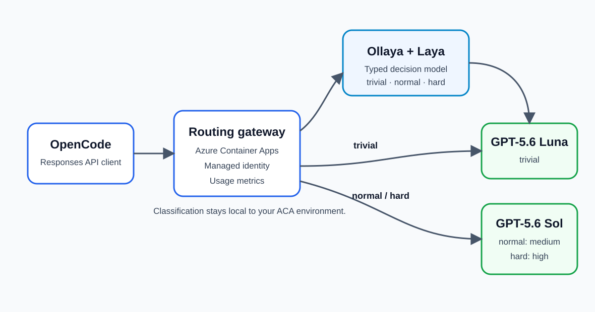

<p align="center">
  
</p>

# Route OpenCode tasks with Ollaya on Azure Container Apps

Run a small decision model once per OpenCode request. Ollaya classifies the current human request as `trivial`, `normal`, or `hard`; the gateway then selects the configured GPT-5.6 tier and reuses that decision throughout the agent loop.

## What you get

- **Ollaya + Laya on CPU** in an internal Azure Container App
- **OpenAI Responses-compatible gateway** for OpenCode
- **GPT-5.6 Luna** for trivial work
- **GPT-5.6 Terra** with medium reasoning for normal work
- **GPT-5.6 Sol** with high reasoning for hard work
- **Managed identity** from the gateway to Azure OpenAI; no model API keys
- **Per-request token metrics** and a repeatable OpenCode benchmark
- **One-command deployment** with `azd up`

## Architecture

The client belongs at the start of the request path:

```text
USER
  │
  ▼
OpenCode
  │  POST /v1/responses
  ▼
ACA routing gateway
  │
  ├── Ollaya + Laya decision (trivial / normal / hard)
  │
  ├── trivial ──► GPT-5.6 Luna, reasoning none
  ├── normal  ──► GPT-5.6 Terra, reasoning medium
  └── hard    ──► GPT-5.6 Sol, reasoning high
```

OpenCode still owns the agent loop, tools, and repository changes. Ollaya only makes the route decision. The gateway rewrites the model and reasoning effort, forwards the request with managed identity, streams the response unchanged, and records usage from the final Responses API event.

The gateway hashes the latest human request and caches its decision for one hour. Tool-loop calls for the same request reuse the route without storing the prompt or running Ollaya again.

## Azure regions

| Resource | Region | Reason |
|---|---|---|
| Azure Container Apps, ACR, Log Analytics | South Central US | Deployment target for this template |
| GPT-5.6 Luna deployment | East US 2 | Current Azure model availability |
| GPT-5.6 Terra and Sol deployments | West US | Current Azure model availability |

The model accounts use Global Standard deployments. Model processing can occur outside the account region under the Global Standard deployment terms.

## Prerequisites

- Azure CLI authenticated with permission to create resources and role assignments
- Azure Developer CLI (`azd`)
- An Azure subscription with `Microsoft.App` and `Microsoft.CognitiveServices` registered
- GPT-5.6 Global Standard quota for Luna in East US 2 and Sol in West US
- OpenCode for the end-user and benchmark flows

Check quota:

```powershell
az cognitiveservices usage list --location eastus2 `
  --query "[?contains(name.value, 'gpt-5.6-luna')]" -o table

az cognitiveservices usage list --location westus `
  --query "[?contains(name.value, 'gpt-5.6-terra') || contains(name.value, 'gpt-5.6-sol')]" -o table
```

## Quick start

```powershell
git clone https://github.com/simonjj/ollaya-on-aca.git
cd ollaya-on-aca

azd env new ollaya-test-1
azd env set AZURE_RESOURCE_GROUP ollaya-test-1
azd env set AZURE_LOCATION southcentralus
azd up
```

`azd up` creates the infrastructure, builds both images in ACR, deploys the internal Ollaya app and public router app, waits for Laya to load, tests one route, calls Azure OpenAI, and writes an ignored `opencode.local.json`.

Each run uses a unique UTC image tag. ACA revisions therefore reference an immutable build instead of relying on a mutable `latest` tag.

## Connect OpenCode

Use the generated local config:

```powershell
$env:OPENCODE_CONFIG = "$PWD\opencode.local.json"
opencode
```

Or start from `opencode.example.json`:

```powershell
$env:OLLAYA_ROUTER_ENDPOINT = azd env get-value ROUTER_ENDPOINT
$env:OLLAYA_ROUTER_API_KEY = azd env get-value ROUTER_API_KEY
$env:OPENCODE_CONFIG = "$PWD\opencode.example.json"

opencode run -m "ollaya-aca/ollaya-auto" "Add validation to the user creation endpoint."
```

The provider uses `@ai-sdk/openai`, not `@ai-sdk/openai-compatible`, because coding-agent tool calls need the Responses API.

## Inspect a route

```powershell
$endpoint = azd env get-value ROUTER_ENDPOINT
$key = azd env get-value ROUTER_API_KEY

Invoke-RestMethod `
  -Method Post `
  -Uri "$endpoint/route" `
  -Headers @{ Authorization = "Bearer $key" } `
  -ContentType "application/json" `
  -Body '{"input":"Rename one variable and update its test."}'
```

Example shape:

```json
{
  "route": "trivial",
  "reasons": ["ollaya:trivial"],
  "topProbability": 0.81,
  "margin": 0.63,
  "deepReasoning": 0.08,
  "complexity": 0.24,
  "ollayaDurationMs": 34.2
}
```

Near-uniform decisions are promoted to `normal`. A high deep-reasoning, complexity, or concurrency-state score promotes the request to `hard`.

## Direct Responses API

```powershell
$body = @{
  model = "ollaya-auto"
  input = "Return a JSON object with the keys name and language for this repository."
  stream = $false
} | ConvertTo-Json

Invoke-RestMethod `
  -Method Post `
  -Uri "$endpoint/v1/responses" `
  -Headers @{ Authorization = "Bearer $key" } `
  -ContentType "application/json" `
  -Body $body
```

Use `ollaya-baseline` to bypass Ollaya and send every request to GPT-5.6 Sol with high reasoning.

## Token-per-task benchmark

The benchmark runs the same three validated OpenCode tasks in two modes:

1. `ollaya-auto`: Ollaya selects the tier for each agent request.
2. `ollaya-baseline`: every agent request uses GPT-5.6 Sol with high reasoning.

The gateway resets its in-memory metrics and decision cache before each run. It records input and output tokens from every Responses API call, reports reasoning tokens separately, and adds Ollaya's local decision-model input tokens to an all-model total. A task counts only when its validation command passes.

```powershell
$env:OLLAYA_ROUTER_ENDPOINT = azd env get-value ROUTER_ENDPOINT
$env:OLLAYA_ROUTER_API_KEY = azd env get-value ROUTER_API_KEY
node .\scripts\benchmark.mjs
```

Results are written to `benchmarks/results.json`.

<!-- BENCHMARK_RESULTS_START -->
Measured on September 30, 2026 with OpenCode 1.18.32. Each cell is one validated run, so these numbers are a reproducible sample rather than a statistically stable model comparison.

| Task | Routed tier | Routed downstream tokens | Baseline downstream tokens | Routed tokens including Ollaya | All-model change | Routed duration | Baseline duration |
|---|---|---:|---:|---:|---:|---:|---:|
| Exact one-line file | Luna | 12,673 | 19,445 | 13,025 | -33.0% | 11.4 s | 19.4 s |
| Shopping-cart feature | Terra | 88,569 | 78,170 | 89,485 | +14.5% | 169.4 s | 155.0 s |
| Concurrent-cache repair | Sol | 118,034 | 97,015 | 119,098 | +22.8% | 355.3 s | 283.8 s |
| **Total** | mixed | **219,276** | **194,630** | **221,608** | **+13.9%** | **536.1 s** | **458.2 s** |

The routed run used 12.7% more downstream tokens and 13.9% more tokens after including 2,332 local Ollaya input tokens. It was 17.0% slower overall. The trivial task benefited substantially, but this sample does not support an overall token-reduction claim.

The hard task used Sol with high reasoning in both modes, yet the two runs still differed by 22.8% in all-model tokens. That spread shows why a single coding-agent run should not be treated as a deterministic model benchmark. Use repeated trials before making a capacity or cost decision.

Decision caching did work as intended: the 78 routed model requests caused three Ollaya evaluations, one per task, and 75 cache hits. The uncached CPU decisions added 3.5-5.6 seconds per task in this deployment; cached calls added no Ollaya inference time. See [`benchmarks/results.json`](benchmarks/results.json) for the request-level totals.
<!-- BENCHMARK_RESULTS_END -->

## API surface

| Method | Path | Purpose |
|---|---|---|
| `GET` | `/healthz` | Gateway and Ollaya readiness |
| `GET` | `/v1/models` | `ollaya-auto` and `ollaya-baseline` |
| `POST` | `/v1/responses` | OpenAI Responses-compatible routed inference |
| `POST` | `/route` | Decision only; no generative model call |
| `GET` | `/admin/metrics` | In-memory request and token metrics |
| `DELETE` | `/admin/metrics` | Reset benchmark metrics |

All endpoints except `/healthz` require `Authorization: Bearer <ROUTER_API_KEY>`.

## Local container validation with WSL Containers

```powershell
wslc build -t ollaya-on-aca-ollaya .\app\ollaya
wslc build -t ollaya-on-aca-router .\app\router

wslc run -d --rm -p 11435:11435 --name ollaya-router-model ollaya-on-aca-ollaya

# Wait for the model to load, then inspect a decision directly.
curl.exe http://localhost:11435/api/decide `
  -H "Content-Type: application/json" `
  -d '{"model":"coding-router","state":"Rename one variable and update the test."}'
```

The gateway's Azure calls require managed identity, so the local smoke test focuses on image startup and Ollaya classification. Unit tests cover request extraction, safety promotion, backend selection, and request rewriting.

```powershell
cd app\router
npm install
npm test
```

## Configuration

| Variable | Default | Purpose |
|---|---|---|
| `LUNA_CAPACITY` | `10` | Global Standard deployment capacity |
| `TERRA_CAPACITY` | `10` | Global Standard deployment capacity |
| `SOL_CAPACITY` | `10` | Global Standard deployment capacity |
| `ROUTER_API_KEY` | generated | Bearer token for the public gateway |
| `OLLAYA_TIMEOUT_MS` | `120000` | Allows a cold CPU model load; warm decisions return much sooner |
| `OLLAYA_MODEL` | `coding-router` | Derived Ollaya model with baked questions |
| `ROUTE_CACHE_TTL_MS` | `3600000` | Reuses one decision throughout an agent loop |

The Ollaya app uses the 2 vCPU/4 GiB consumption size. Laya's fp32 graph and ONNX Runtime exceed the 1 vCPU/2 GiB profile during model load.

The gateway fails explicitly if Ollaya, managed identity, or an upstream model fails. It does not silently claim success or downgrade around errors.

## Security

- Azure OpenAI local key authentication is disabled.
- The router uses a user-assigned managed identity with only `Cognitive Services OpenAI User`.
- ACR admin credentials are disabled; both apps pull through managed identity.
- Ollaya has internal-only ingress.
- The public gateway requires a generated bearer token.
- The bearer token and generated OpenCode config stay in the local `.azure` state and ignored files.

For a production shared service, put Azure API Management or another identity-aware edge in front of the gateway and replace the static bearer token with organizational authentication.

## Project structure

```text
ollaya-on-aca/
├── app/
│   ├── ollaya/              # Ollaya image, routing questions, startup
│   └── router/              # Responses proxy, policy, metrics, tests
├── benchmarks/
│   ├── fixtures/            # Validated trivial, normal, and hard tasks
│   └── tasks.json
├── hooks/                   # azd setup, image builds, deploy, smoke tests
├── infra/                   # ACA, ACR, identities, Azure OpenAI deployments
├── misc/images/
├── scripts/benchmark.mjs
├── azure.yaml
└── opencode.example.json
```

## Troubleshooting

| Problem | Check |
|---|---|
| Model deployment fails with quota | Run the quota commands above and lower or request capacity |
| Router stays unhealthy | Inspect both app logs; Ollaya pulls Laya during first startup |
| Azure OpenAI returns `403` | Confirm the router identity has `Cognitive Services OpenAI User` on both accounts |
| OpenCode calls `/chat/completions` | Use `@ai-sdk/openai`; the router implements `/v1/responses` |
| Benchmark has zero usage | Confirm Azure streamed a `response.completed` event and inspect router logs |
| ACR image pull fails | Confirm the app identity has `AcrPull` and is configured as registry identity |

Logs:

```powershell
$rg = azd env get-value AZURE_RESOURCE_GROUP
az containerapp logs show -g $rg -n (azd env get-value OLLAYA_APP_NAME) --follow
az containerapp logs show -g $rg -n (azd env get-value ROUTER_APP_NAME) --follow
```

## Tear down

```powershell
azd down
```

This removes the selected azd environment's resource group after confirmation.

## License

Apache 2.0. See [LICENSE](LICENSE).
